# Getting Started with Terraform on AWS: State

Terraform state is a critical component of Terraform and is crucial to understand when building automated solutions. Lack of understanding of how to manage state can result in automation heartaches or even infrastructure outages. 

The best way to understand how Terraform state works is to know why it is needed in the first place. Terraform is a declarative language, meaning you specify what needs to be created in the Terraform configuration file, and Terraform will deploy it in AWS in the correct order:
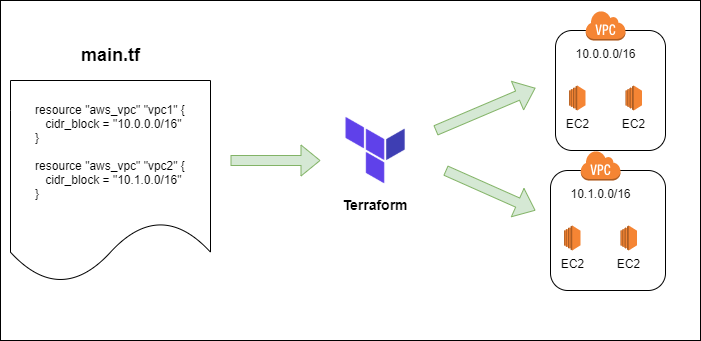

This declarative nature makes Terraform very scalable when managing cloud resources. It would be hard to use Bash or Python to script out the hundreds of resources in AWS and manage them all:
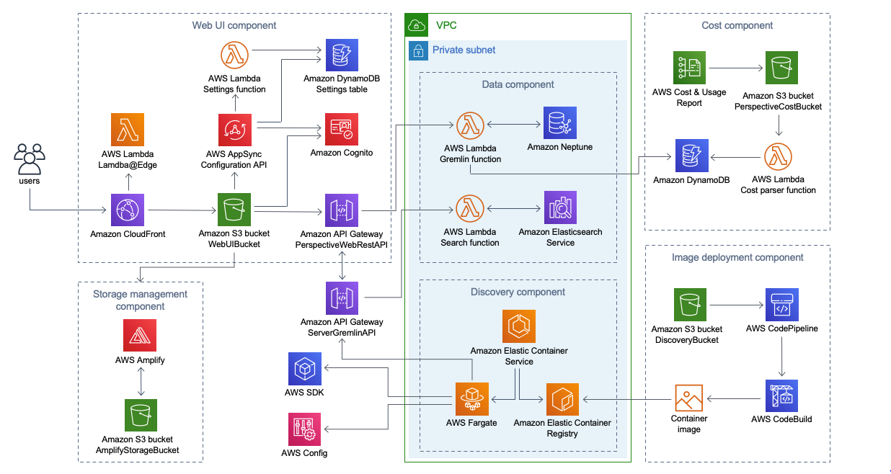

But you might ask. Can't Terraform query the cloud provider to see what resources are there and then create the missing ones instead of using a state file? This strategy was looked at originally in the very early days of Terraform. However, certain scenarios like the following would cause issues.

When removing resources from a Terraform configuration file, Terraform still needs to know the dependencies to destroy the removed resources. Remember, it's declarative, so if you were to remove a network and server that was originally deployed with Terraform, you would simply omit it from the configuration, and Terraform would destroy those resources on the next `terraform apply`:
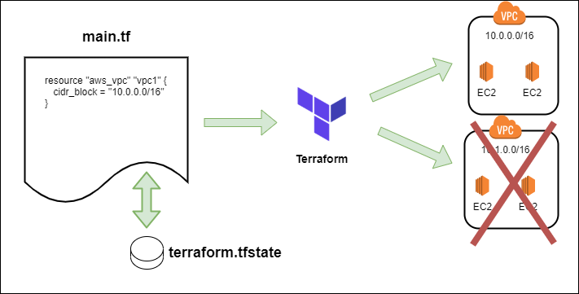


The `terraform.tfstate` file provides Terraform the information it needs to determine that the 2nd VPC exists and no longer needs to be there.  It also contains the dependencies of each resource to determine the order on what to destroy first. 

Also, performance can be an issue with large AWS environments without a state file. Querying each resource would take way too long and hold up automation processes. Instead, the state file is used as the source of truth, and Terraform can scale easier without performance hits.

In this guide, you will explore how the state works in Terraform and see why it a core part of the automation tool.

# Prerequisites

Before you begin, you'll need to set up the following:

- [**AWS subscription**](https://aws.amazon.com/) - We will be using Free Tier resources only
- [**Install AWS CLI**](https://docs.aws.amazon.com/cli/latest/userguide/cli-chap-install.html) - Used to authenticate to AWS
- [**Visual Studio Code**](https://code.visualstudio.com/) - or some IDE/Text Editor
- [**Install Terraform**](https://www.terraform.io/downloads.html) - This guide will cover Terraform 0.13

# Step 1 - Inspect the State File

A state file is created after a resource has been deployed into AWS by Terraform. Copy the configuration below and paste it into a `main.tf` file in a directory:
```hcl
terraform {
  required_providers {
    aws = {
      source  = "hashicorp/aws"
      version = "3.7"
    }
  }
}

provider "aws" {
  region = "us-west-2"
}

resource "aws_vpc" "vpc1" {
  cidr_block = "10.0.0.0/16"

  tags = {
    Name = "Production"
  }
}

resource "aws_vpc" "vpc2" {
  cidr_block = "10.1.0.0/16"

  tags = {
    Name = "Development"
  }
}

resource "aws_subnet" "snet-prod" {
  vpc_id     = aws_vpc.vpc1.id
  cidr_block = "10.0.1.0/24"

  tags = {
    Name = "Production"
  }
}

resource "aws_subnet" "snet-dev" {
  vpc_id     = aws_vpc.vpc2.id
  cidr_block = "10.1.1.0/24"

  tags = {
    Name = "Development"
  }
}

resource "aws_instance" "web1" {
  ami           = "ami-0d398eb3480cb04e7"
  instance_type = "t3.micro"
  subnet_id = aws_subnet.snet-prod.id

  tags = {
    Name = "web1"
  }
}

resource "aws_instance" "web2" {
  ami           = "ami-0d398eb3480cb04e7"
  instance_type = "t3.micro"
  subnet_id = aws_subnet.snet-dev.id
  tags = {
    Name = "web2"
  }
}
```
Open up a terminal in the directory of the `main.tf` file and 
input the following command to authenticate with your AWS account:
```
aws configure
```
The CLI prompts for an [AWS key and secret](https://aws.amazon.com/premiumsupport/knowledge-center/create-access-key/). This account will be used to create resources in AWS with Terraform.

After AWS CLI has been authenticated, input the following commands to initialize the directory and create the two VPCs, Subnets, and EC2 instances:
```
terraform init

terraform apply
```
Input *yes* to start deploying the resources:
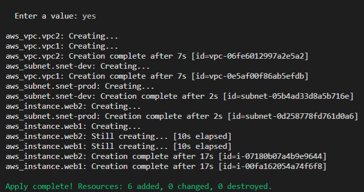

Because resources have been successfully created with Terraform, the `terraform.tfstate` file was created in the directory and is populated with the resource metadata:


Open up the state file either in another tab in VSCode or with a text editor. You can see each resource specified in the `main.tf` file is mapped by its resource block label to its ARN in the AWS environment. Terraform state acts as the database between the Terraform configuration file and the AWS environment:

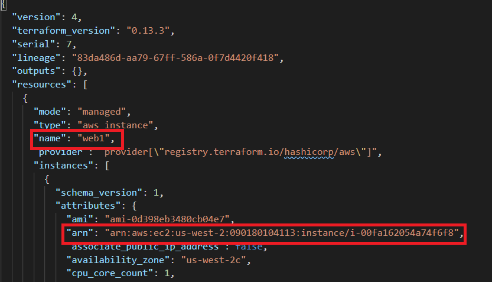

> **Terraform History Lesson:** Very early prototypes of Terraform actually didn't even use state files and instead used the AWS Tags to map resources. However, this became an issue with AWS resources that didn't support tags and was not scalable to other Cloud Service providers or systems.

The `terraform.tfstate` file pulls down metadata of the resources as well. This means that the state file has sensitive information that could be used maliciously to access the resources. Be cautious with your state file and where it is located. Don't store it into public git repositories. When storing Terraform code in Git, be sure to use `.gitignore` files in any git repository to omit any .tfstate files from getting committed automatically. 

Because the state file contains sensitive information, it is recommended to use a feature called remote state, which you'll explore further in a future guide in this series. 

Now that the state file is created and the AWS infrastructure is deployed, you can now explore what happens when resources are modified or deleted.

# Step 2 - Modifying Infrastructure

Now you know that each resource in the Terraform config file is mapped to an AWS ARN. But what happens if you rename a resource block label in the Terraform configuration file? 

In the `main.tf` file, rename the **web2** block label to **server2**:
```
resource "aws_instance" "server2" {
  ami           = "ami-0d398eb3480cb04e7"
  instance_type = "t3.micro"
  subnet_id = aws_subnet.snet-dev.id
  tags = {
    Name = "web2"
  }
}
```

Save the `main.tf` file and run `terraform plan` in the terminal to see the potential outcome of this change:

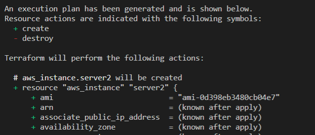

The execution plan shows that Terraform will recreate the web2 EC2 instance. Since the resource block label has been changed from `web2` to `server2`, Terraform cannot match up the existing AWS resource in `terraform.tfstate` and will try to remove the old and add a new one. This is why it's important never to change the resource block labels after the infrastructure has been deployed. Be sure to plan the label naming scheme properly ahead of time.

In the `main.tf` file, change the resource block label of `server2` back to `web2` and this time modify the `instance_type` to be a `t2.micro`:

```
resource "aws_instance" "web2" {
  ami           = "ami-0d398eb3480cb04e7"
  instance_type = "t2.micro"
  subnet_id = aws_subnet.snet-dev.id
  tags = {
    Name = "web2"
  }
}
```
Save the `main.tf` file and run `terraform plan` in the terminal to see the potential outcome of this change:

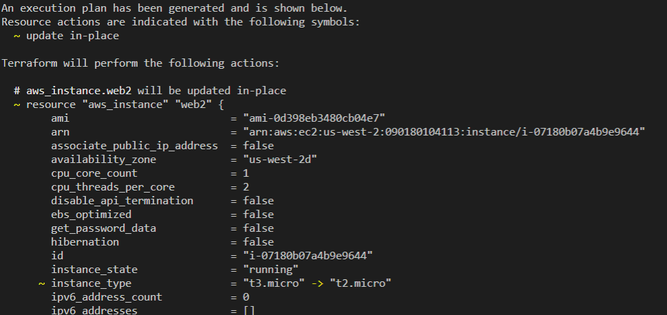

The execution plan shows that the web2 instance will be updated to a `t2.micro` size if Terraform were to apply the configuration. Reading the execution plan and being able to decipher the outcome is critical when managing infrastructure with Terraform. You may also output the execution plan to a file by typing the following command in the terminal:
```
terraform plan -out=tfplan
```
The execution plan is saved to a `tfplan` file and can be reviewed later by a team to collaborate on the outcome. To view the contents of the plan file use `terraform show` followed by the name of the file:
```
terraform show tfplan
```

Now, in the `main.tf` file, remove the entire VPC2 and it's subnet and EC2 instance. The entire `main.tf` file should look like the following:
```
terraform {
  required_providers {
    aws = {
      source  = "hashicorp/aws"
      version = "3.7"
    }
  }
}

provider "aws" {
  region = "us-west-2"
}

resource "aws_vpc" "vpc1" {
  cidr_block = "10.0.0.0/16"

  tags = {
    Name = "Production"
  }
}

resource "aws_subnet" "snet-prod" {
  vpc_id     = aws_vpc.vpc1.id
  cidr_block = "10.0.1.0/24"

  tags = {
    Name = "Production"
  }
}

resource "aws_instance" "web1" {
  ami           = "ami-0d398eb3480cb04e7"
  instance_type = "t3.micro"
  subnet_id = aws_subnet.snet-prod.id

  tags = {
    Name = "web1"
  }
}

```
Save the `main.tf` file and run a `terraform apply`:

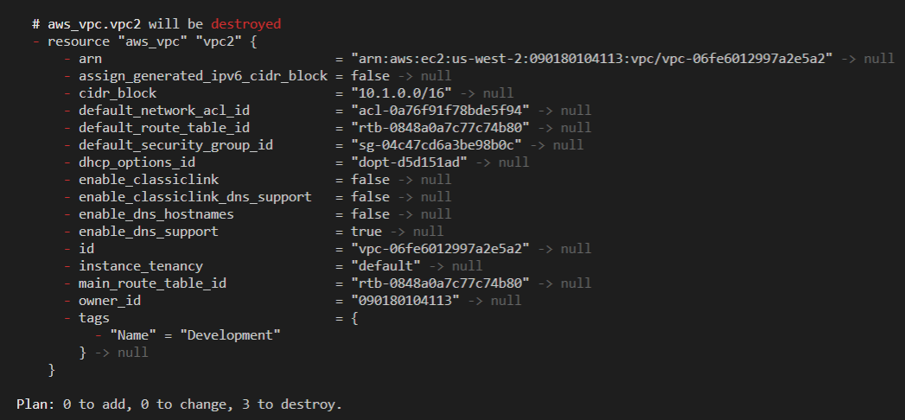

Because VPC2 and it's Subnet, and EC2 Instance were removed from the configuration. Terraform will look at the `terraform.tfstate` file and determine what resources are no longer specified in `main.tf`. It will then try to remove those resources, which is demonstrated by the execution plan.

In the terminal, input *yes* and watch the resources get destroyed:
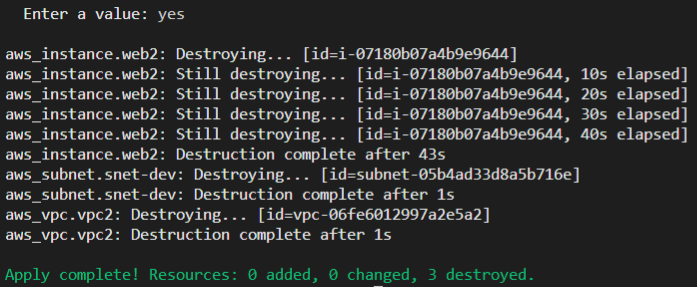


But, how does Terraform know the order to destroy the VPC2 resources? We removed them from `main.tf`, so how did it know? The `terraform.tfstate` file also contains the dependencies of each resource, so it knows how each resource is destroyed and what order to do it in:
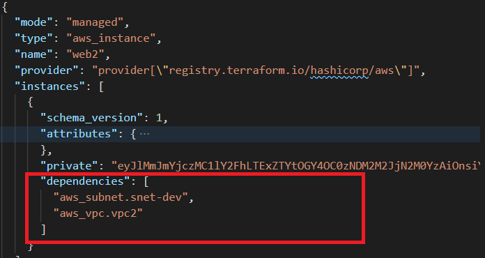

This is where the state file comes in, and simply querying the AWS resources and making changes based on that will not work.

By now, you can see that the Terraform configuration file acts as a mirror of what should be in AWS, and Terraform does the job of making sure AWS looks like the resources described in `main.tf`.

Now that you have a better understanding on how the state file functions. In the next step, you will take it a step further and explore the `terraform refresh` command.  

# Step 3 - Terraform Refresh

Modify the `terraform.tfstate` file and change the web1 instance type to `t2.micro`. Make sure to save the file afterward:

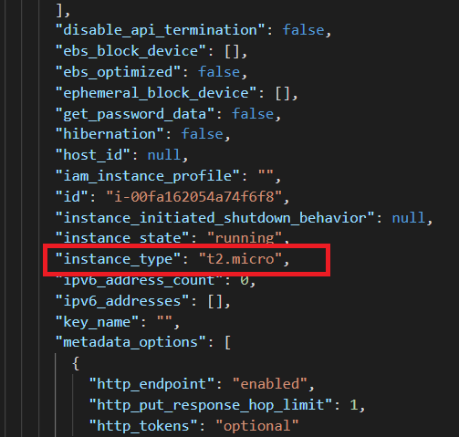

> **Warning**: Don't directly edit the state file in production! This is just for learning purposes; results could end up corrupting the file.


Now run the following command in the terminal:
```
terraform refresh
```
Check the `terraform.tfstate` file again. Notice the `instance_type` changed back to `t3.micro`.

What happens if the EC2 instance is modified in AWS instead? Log in to the [AWS console](https://console.aws.amazon.com/). Navigate to the EC2 dashboard and stop the **web1** EC2 instance. Right-click on the EC2 instance and select **Stop instance**. After the instance has stopped, right-click on the EC2 instance and select **Instance settings** > **Change instance type**:

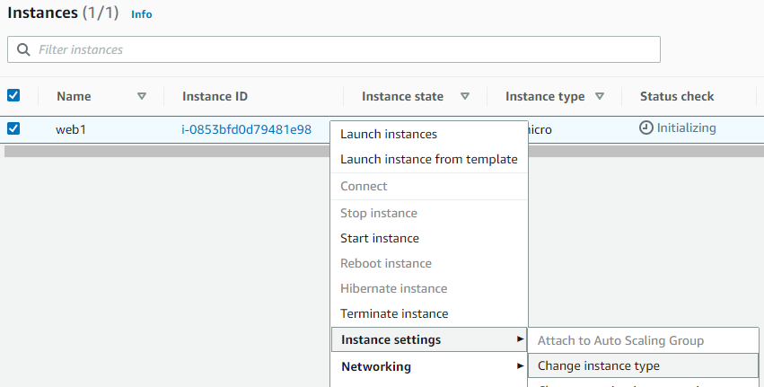

Select the *t2.micro* instance type and click **Apply**:

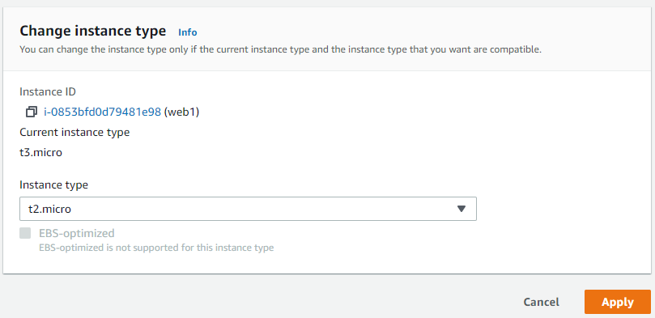

Right-click on the EC2 instance again and select **Start instance**. Navigate back to the terminal in the Terraform directory and input another `terraform refresh` in the terminal:
```
terraform refresh
```

The `terraform.tfstate` state file updates to reflect the change that was made in the AWS console. However, now run `terraform plan`:

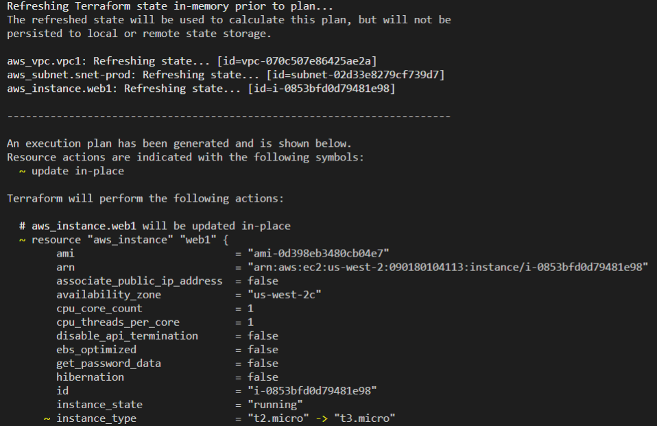


> **Notice:** In the screenshot above, you can see when running `terraform plan` or `terraform apply`, a `terraform refresh` is automatically initiated first. This provides the state file with the most accurate information in the AWS environment before performing a plan or apply.

The execution plan shows that the EC2 instance type will be changed if the configuration is applied. This is because the `main.tf` was never updated. Since the EC2 instance was updated manually through the AWS console, the `main.tf` is out of date and can no longer safely be used to manage the infrastructure until it's up to date. This brings up an important issue referred to as the *golden rule* in the Terraform community. If you use Terraform to manage the AWS resources, make sure you ONLY manage them with Terraform for their lifecycle, or the Terraform code will no longer be useful. This happens ALOT and is a big issue among teams. The entire team must be skilled in using Terraform and manage infrastructure or Terraform quickly becomes unusable due to one-off modifications of resources through the AWS console. It only takes one person.

To clean up the environment be sure to run a `terraform destroy` in the terminal.


# Conclusion

In this guide, you learned about Terraform State and how important it is when using Terraform effectively. You learned about the golden rule and how modifying infrastructure using the AWS console can quickly cause Terraform configurations to become unusable. You also explored the `terraform refresh` command and how it is used to sync AWS resources' metadata with `terraform.tfstate`. Terraform State is one of the pillars of using Terraform and is crucial to understand when building infrastructure as code with Terraform. 


